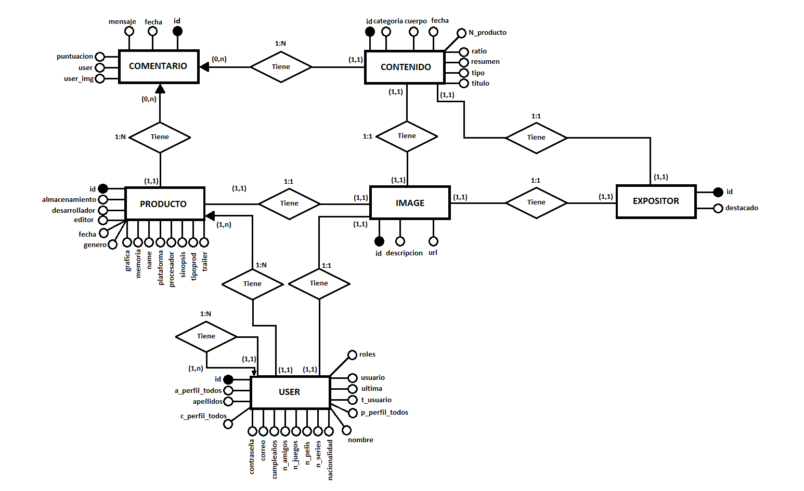

# GG (Gamer Generation)

## Contribuidores: 

  Nombre: Jaime Alvarez Gómez, Correo: j.alvarezgo@alumnos.urjc.es, Github: xeven95
  
  Nombre: Laura Martín Hijosa,  Correo: l.martinhi@alumnos.urjc.es, Github: Lauram25
  
  Nombre: Sergio Serrano Serrano,  Correo: s.serranoserr@alumnos.urjc.es, Github: Sergioserr
  
  Nombre: Álvaro Pavón Alvarado,  Correo: a.pavonal@alumnos.urjc.es, Github: Alvaro95pa

## Trello:

  https://trello.com/b/mgWRrV5M/daw
  
  
## Descripción:

La página principal muestra un listado de los ultimos posts (noticias y análisis) añadidos a la web, junto con una barra de navegación y una opción para iniciar sesión o registrarse. Consta de un componente en el que se muestran todas las películas, series y videojuegos sobre los que se tengan datos, así como diversas opciones para filtrar la información mostrada. A su vez, posee dos componentes similares para mostrar en uno el listado de noticias y en otro el listado de análisis. También se puede acceder a la versión completa de cada noticia y análisis. Los usuarios registrados tienen acceso a una mayor funcionalidad, destacando la posibilidad de realizar comentarios en los posts y añadir series/juegos a una lista de favoritos.

## Entidades:

	Usuario
	
	Comentarios

	Catálogo
	
	Expositor

	Noticias/Análisis
    
# FASE 4:
	
## Instrucciones para descargar y ejecutar:
 
 -Para descargar el último tag del repositorio se puede utilizar la opción de descargar en .zip directamente desde la rama master.
  Puesto que se trata de un repositorio público se puede obtener la última versión (tag: Fase 4) clonando el repositorio a local.
  
 -La forma más recomendable para visualizar el código es importar el contenido de la carpeta Spring al framework Spring Tool Suite.
  Desde el framework simplemente se ejecuta la aplicación utilizando la clase main. La aplicación estará disponible en la dirección 
  https://localhost:8443
  
 -Se ha comprobado su perfecto funcionamiento en los siguientes navegadores:
  	Google Chrome.
  	Mozilla Firefox.
    
## Información necesaria para la consulta de la base de datos MYSQL:
 
 -Usuario: raiz
 
 -Contraseña: contra
 
 -Dirección: jdbc:mysql://localhost/ggmysql

  
### Diagrama de clases Java del servidor:
 

### Diagrama de entidad/relación de la BBDD:

### Enlace al vídeo de muestra de interacción de la aplicación web:
 
 https://youtu.be/ox06zjLiX28
 
